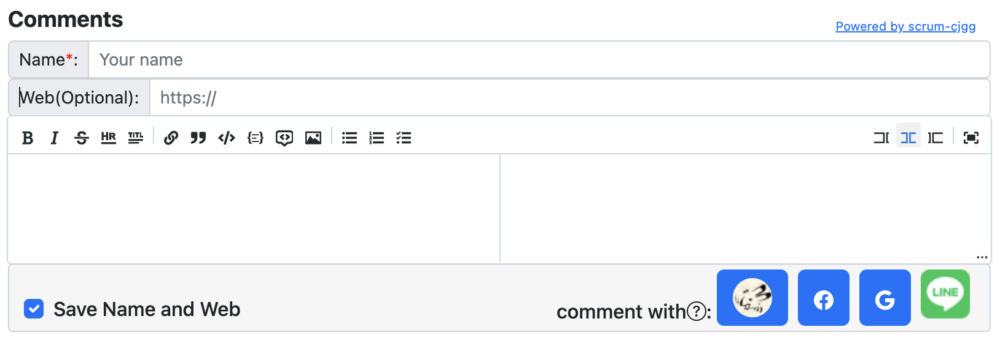
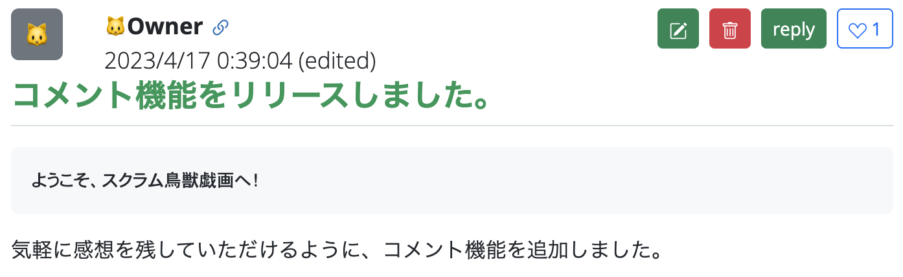

# react-serverless-blog-comments

- hugoなど静的なブログサイトのためのサーバーレスなコメントシステムです。
  - Apache 2.0ライセンスのオープンソースなので好きに編集してご活用ください。

## ライブDEMO

- [スクラム鳥獣戯画](https://www.scrum-cjgg.com)のブログページに設置されています。

- スクリーンショット

## 想定ユーザー層

- コメント機能のためにサーバーを持ちたくない
- 有料あるいは広告の入る外部サービスを使いたくない
- 低コストで運用したい
- 普段からAWSやamplifyを使っている

## 主な特徴

- amplifyを使って**サーバーレスな環境を簡単に**構築できます。
- ログイン機構(Cognito)を持つことで**スパム対策**としています。
  - 既存のCognitoと連携することもできます。
- **ソーシャルログイン連携**（Google/Facebook/LINE）できます。
  - ソーシャルログイン連携しなくても使えます。

## コメント機能

- ブログのページごとにコメントを持てます。
- コメントにはマークダウン形式を使えます。
- 投稿されたコメントは誰でも閲覧できます。
- 投稿されたコメントは投稿者により編集、削除できます。
- 返信(Reply)は3階層までネスト可能です。
- 投票(Voting)機能があります。
- 投稿者の名前の先頭一文字がアイコンになります。
- WebサイトへのURLリンクを1つ指定できます。
- 投稿時の名前、URLリンクは保存して維持できます。
- 書きかけのコメントは保持され、再度編集時に読み込まれます。
- コメント表示例

## わかるひと向けの簡単な説明
- [わかるひと向けの簡単な説明](docs/simple.md)

## 導入手順
- [導入手順](docs/setup.md)

## config設定
- [config設定](docs/config.md)

## hugoへの組み込み例
- [hugoへの組み込み例](docs/hugo.md)

## アーキテクチャ
- [アーキテクチャ](docs/architecture.md)

## 細かい仕様
- [細かい仕様](docs/hint.md)
