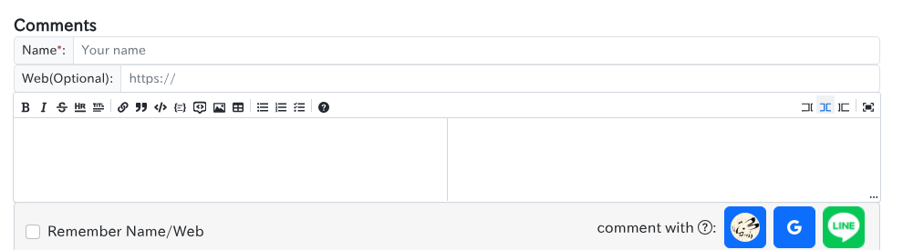
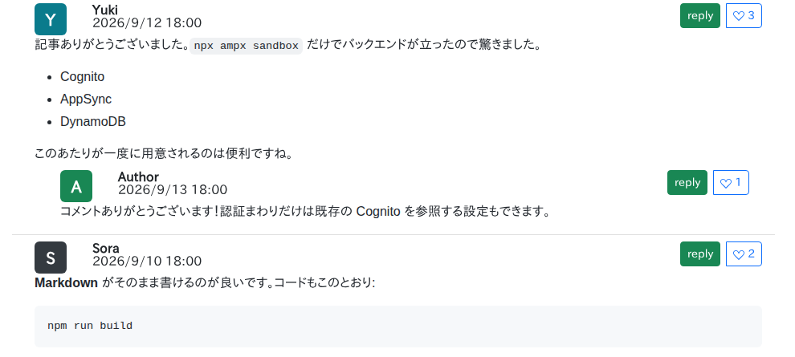
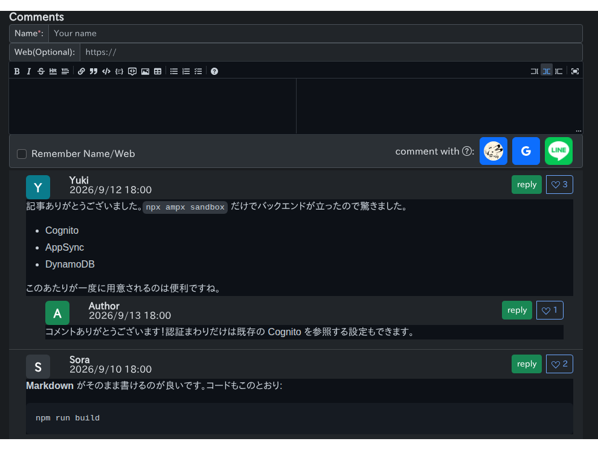

# react-serverless-blog-comments

- hugo など静的なブログサイトのための、サーバーレスなコメントシステムです。
  - Apache 2.0 ライセンスのオープンソースなので、好きに編集してご活用ください。
- バックエンドは AWS Amplify Gen2（Cognito + AppSync + DynamoDB + Lambda）、
  フロントエンドは React 19 + Vite です。

## ライブDEMO

- [スクラム鳥獣戯画](https://www.scrum-cjgg.com) のブログページに設置されています。

## 画面

投稿フォーム。名前と Web(任意) を入れ、本文は Markdown エディタで書きます。
右下の「comment with」からログインすると Send ボタンが出ます。



投稿されたコメント。Markdown はサニタイズしたうえで描画し、返信は 3 階層までネストします。
名前の先頭一文字がアバターになります。



OS の設定に追従してダークでも表示します（強制もできます。[ライトとダーク](docs/hugo.md#ライトとダーク)）。



## 想定ユーザー層

- コメント機能のためにサーバーを持ちたくない
- 有料あるいは広告の入る外部サービスを使いたくない
- 低コストで運用したい
- 普段から AWS を使っている

## 主な特徴

- Amplify Gen2 で**サーバーレスな環境を `npx ampx sandbox` の一発で**構築できます。
- ログイン機構(Cognito)を持つことで**スパム対策**としています。
  - 専用のユーザープールを新しく作れます。既存の Cognito を参照することもできます。
- **ソーシャルログイン連携**を追加できます（Google / LINE ほか）。
  - 連携しなくても、メールアドレスでのサインアップだけで使えます。
- 埋め込み先のデザインを壊しません。スタイルはすべて `#blogcomments` 配下に限定してあり、
  **Bootstrap などの CSS を読み込ませる必要はありません。**

## コメント機能

- ブログのページごとにコメントを持てます。
- コメントにはマークダウン形式を使えます（サニタイズ済み）。
- 投稿されたコメントは誰でも閲覧できます。
- 投稿されたコメントは投稿者により編集、削除できます。
- 返信(Reply)は3階層までネスト可能です。
- 投票(Voting)機能があります。
- 投稿者の名前の先頭一文字がアイコンになります。
- Web サイトへの URL リンクを1つ指定できます。
- 投稿時の名前、URL リンクは保存して維持できます。
- 書きかけのコメントは保持され、再度編集時に読み込まれます。
- OS の `prefers-color-scheme` に追従したライト/ダーク表示に対応しています。

## ドキュメント

| | |
| --- | --- |
| [わかる人向けの簡単な説明](docs/simple.md) | 何をするものかを最短で |
| [事前準備](docs/prepare.md) | AWS アカウントと CLI の用意 |
| [導入手順](docs/setup.md) | バックエンド構築からデプロイまで |
| [hugoへの組み込み例](docs/hugo.md) | ブログ側への設置 |
| [config設定](docs/config.md) | ログインボタンの表示切り替えなど |
| [アーキテクチャ](docs/architecture.md) | 構成と設計の意図 |
| [細かい仕様](docs/hint.md) | 仕様・既知の制限・変更のヒント |
| [代替手段](docs/alternative.md) | 他のコメントシステムとの比較 |

## 最短手順

```sh
git clone https://github.com/neco-/react-serverless-blog-comments
cd react-serverless-blog-comments
npm ci
npx ampx sandbox     # 自分の AWS にバックエンド一式が立ち、amplify_outputs.json が出る
npm run build        # build/static/js/main.min.js
```

Node.js 22 以上が必要です。

---

# 開発者向け

## npm scripts

| コマンド | 内容 |
| --- | --- |
| `npm start`（`npm run dev`） | 開発サーバー（http://localhost:3000） |
| `npm run build` | `tsc` で型検査してから `build/` へ本番ビルド |
| `npm run preview` | 本番ビルドをローカルで配信して動作確認 |
| `npm test` | フロント（Vitest + jsdom）と Lambda（Vitest + node）のテスト |
| `npm run test:watch` | 同じテストを監視モードで回す |

ビルドは Hugo 側から読み込みやすいよう、ハッシュなしの固定ファイル名で出力します
（`build/static/js/main.min.js` / `build/static/css/main.min.css`）。
URL が変わらないので、配信側で `Cache-Control` を設定してください
（[導入手順](docs/setup.md#キャッシュの設定)）。

## テストと構成

- テストは Amplify Hosting のビルドでも実行され、失敗するとデプロイされません（`amplify.yml`）。
- ローカルでビルドするには `cp amplify_outputs.example.json amplify_outputs.json` で設定の雛形を置いてください
  （本物は `npx ampx sandbox` または Amplify Hosting のビルドで生成されます）。
- Amplify SDK を直接呼ぶのは `src/lib/authClient.ts`, `src/lib/apiClient.ts`, `src/index.tsx` だけです。
  フックやコンポーネントは `useAuthClient()` / `useApiClient()` を使い、テストでは
  `src/test/fakes.ts` のフェイクを注入します。
- バックエンドは Amplify Gen2（`amplify/backend.ts`）です。認証は既定で専用の Cognito を作り、
  環境変数が揃っていれば既存のプールを `referenceAuth` で参照します（`amplify/auth/resource.ts`）。
- Lambda（`amplify/functions/*/handler.mjs`）は Node.js 22 と AWS SDK v3 を使います。
  テストは `tests/lambda/` にあり、DynamoDB はモックします。
- `npx tsx scripts/print-schema.ts` で、デプロイせずに生成される GraphQL スキーマを確認できます。
- `node scripts/guest-query.mjs '<query>'` で、未ログイン（ID プールのゲスト）として API を叩けます。
  AWS の認証情報は不要で、ゲスト読み取りの権限確認に使います。
- `node scripts/copy-table.mjs <コピー元テーブル> <コピー先テーブル> [--dry-run]` で DynamoDB の
  テーブルを全件コピーします（小さなテーブル向け）。環境を作り直したときの移行用で、通常の運用では使いません。
- バックエンドやランタイムを更新したあとは [docs/verification-checklist.md](docs/verification-checklist.md)
  を検証環境で通してください。

## 注意

コメント本文は他人が書いたものをそのまま描画する場所です。`rehype-sanitize` を外すと
フィッシングやクリックジャッキングに使える HTML が通ります。Markdown の描画まわりを触ったら
`src/components/viewer/Comment.sanitize.test.tsx` が通ることを確認してください。

## 貢献

Issue と Pull Request を歓迎します。進め方は [CONTRIBUTING.md](CONTRIBUTING.md) を参照してください。

## 脆弱性の報告

公開の Issue ではなく [SECURITY.md](SECURITY.md) の手順で連絡してください。

## ライセンス

Apache License 2.0
