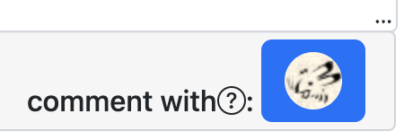
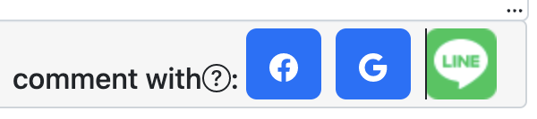
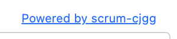

# config設定

- src/config.tsが設定ファイルになっています。

## ログインボタンの表示/非表示

- src/config.tsでログインボタンの表示非表示を切り替えることができます。
  - 修正後はamplify publishまたはnpm run buildでbundleを更新してください。
  - `true`または`false`を指定します。
    ```js
    export const ENABLED_OAUTH_ORIGINAL = true
    export const ENABLED_OAUTH_GOOGLE = true
    export const ENABLED_OAUTH_FACEBOOK = true
    export const ENABLED_OAUTH_LINE = false
    ```
  - 例）自前のログイン機能のみ
    ```js
    export const ENABLED_OAUTH_ORIGINAL = true
    export const ENABLED_OAUTH_GOOGLE = false
    export const ENABLED_OAUTH_FACEBOOK = false
    export const ENABLED_OAUTH_LINE = false
    ```
    
  - 例）ソーシャルログインのみ
    ```js
    export const ENABLED_OAUTH_ORIGINAL = false
    export const ENABLED_OAUTH_GOOGLE = true
    export const ENABLED_OAUTH_FACEBOOK = true
    export const ENABLED_OAUTH_LINE = true
    ```
    

## シグネチャの表示/非表示

- `Powered by scrum-cjgg`のリンクの表示非表示を切り替えることができます。
  - 残しておいてもらえるとちょっとうれしいです。
  ```js
  export const IS_SHOW_SIGNATURE = true
  ```
  

## OAuthのリダイレクト先ドメイン名

- OAuthを本番運用する場合にカスタムドメインを指定します。
  - 値が設定されている場合はHosted UIのリダイレクト先をこのドメインに向けます。
  - 空の場合は特に何もしません。
  ```js
  export const OAUTH_DOMAIN = ""
  ```
