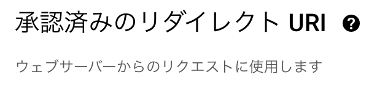
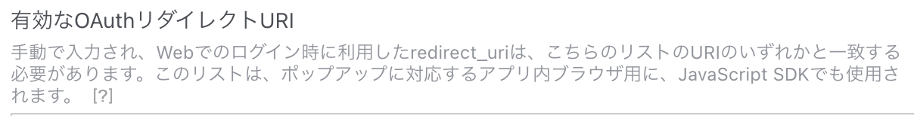

# 導入手順

## 完了の定義

- amplifyでバックエンド基盤が構築できる（環境構築）
- BlogCommentsのbudleをビルドできる（bundleのjsが生成される）
- BlogCommentsをPublishできる（CDNへの配置）

## 事前準備

- [事前準備](prepare.md)をご確認ください。
  - 普段AWSを利用している方は不要かもしれません。

## 前提知識

- AWSのサービス（Amplify, Cognito, AppSync, DynamoDB, Lambda, ...）がわかる
- aws/amplify CLIが使える
- gitがわかる
- JavaScript/TypeScriptがわかる
- React/Node.js/npmがわかる
- ネットワークの知識（DNS, OAuth2.0, CORS）がある

## 手順
```
ログを貼っているので長いですが、コマンドを打っていくだけです。
一度行えばご自身のamplify環境が構築されます。
```

## 手順1. amplifyをセットアップ
- 対象とするAWSアカウント、リージョンに向けて設定します。
- gitからcloneして、amplify initします。
  ```sh
  $ amplify init --app https://github.com/neco-/react-serverless-blog-comments
  ```
  or
  ```sh
  $ git clone https://github.com/neco-/react-serverless-blog-comments
  $ amplify init
  ```
  例:
  <pre>
  $ <b>amplify init</b>
  Note: It is recommended to run this command from the root of your app directory
  ? Enter a name for the project <b><font color="lightgreen">blogcomments</font></b>
  The following configuration will be applied:

  Project information
  | Name: blogcomments
  | Environment: dev
  | Default editor: Visual Studio Code
  | App type: javascript
  | Javascript framework: react
  | Source Directory Path: src
  | Distribution Directory Path: build
  | Build Command: npm run-script build
  | Start Command: npm run-script start

  ? Initialize the project with the above configuration? <b><font color="lightgreen">No</font></b>
  ? Enter a name for the environment <b><font color="lightgreen">prod</font></b>
  ? Choose your default editor: <b><font color="lightgreen">Vim (via Terminal, macOS only)</font></b>
  ? Choose the type of app that you're building <b><font color="lightgreen">javascript</font></b>
  Please tell us about your project
  ? What javascript framework are you using <b><font color="lightgreen">react</font></b>
  ? Source Directory Path:  <b><font color="lightgreen">src</font></b>
  ? Distribution Directory Path: <b><font color="lightgreen">build</font></b>
  ? Build Command:  <b><font color="lightgreen">npm run-script build</font></b>
  ? Start Command: <b><font color="lightgreen">npm run-script start</font></b>
  Using default provider  awscloudformation
  ? Select the authentication method you want to use: <b><font color="lightgreen">AWS profile</font></b>

  For more information on AWS Profiles, see:
  https://docs.aws.amazon.com/cli/latest/userguide/cli-configure-profiles.html

  ? Please choose the profile you want to use <b><font color="lightgreen">default</font></b>
  Adding backend environment prod to AWS Amplify app: dsro8ipnqmofb

  Deployment completed.
  Deploying root stack blogcomments [ ---------------------------------------- ] 0/4
  	amplify-blogcomments-prod-222… AWS::CloudFormation::Stack     CREATE_IN_PROGRESS             Sun Apr 30 2023 22:25:35…
  	UnauthRole                     AWS::IAM::Role                 CREATE_IN_PROGRESS             Sun Apr 30 2023 22:25:38…
  	DeploymentBucket               AWS::S3::Bucket                CREATE_IN_PROGRESS             Sun Apr 30 2023 22:25:38…
  	AuthRole                       AWS::IAM::Role                 CREATE_IN_PROGRESS             Sun Apr 30 2023 22:25:38…

  ✔ Help improve Amplify CLI by sharing non sensitive configurations on failures (y/N) · <b><font color="lightgreen">no</font></b>
  Deployment state saved successfully.
  ✔ Initialized provider successfully.
  ✅ Initialized your environment successfully.
  </pre>
  - プロジェクト名の`blogcomments`は合わせておいた方がよいと思います。
  - 環境名、エディタ、プロファイルはご自身の環境に合わせてください。
  - ディレクトリ構成はデフォルトのままです。

## 手順2. 認証をセットアップ
- 認証基盤をセットアップします。
  - 自前のログイン機構（Cognito）を新規に作成します。
  - ソーシャルログインでOAuthを使う場合はここでセットアップします。
  ```sh
  $ amplify auth add
  ```
  例:
  <pre>
  $ <b>amplify auth add</b>
  Using service: Cognito, provided by: awscloudformation

   The current configured provider is Amazon Cognito.

   Do you want to use the default authentication and security configuration? <b><font color="lightgreen">Manual configuration</font></b>
   Select the authentication/authorization services that you want to use: <b><font color="lightgreen">User Sign-Up, Sign-In, connected with AWS IAM controls (Enables per-user Storage features for images or other content, Analytics, and more)</font></b>
   Provide a friendly name for your resource that will be used to label this category in the project: <b><font color="lightgreen">blogcommentsXXXXXXXXXXXXXXXX</font></b>
   Enter a name for your identity pool. <b><font color="lightgreen">blogcommentsXXXXXXXX_identitypool_XXXXXXXX</font></b>
   Allow unauthenticated logins? (Provides scoped down permissions that you can control via AWS IAM) <b><font color="lightgreen">Yes</font></b>
   Do you want to enable 3rd party authentication providers in your identity pool? <b><font color="lightgreen">No</font></b>
   Provide a name for your user pool: <b><font color="lightgreen">blogcommentsXXXXXXXX_userpool_XXXXXXXX</font></b>
   Warning: you will not be able to edit these selections.
   How do you want users to be able to sign in? <b><font color="lightgreen">Username</font></b>
   Do you want to add User Pool Groups? <b><font color="lightgreen">No</font></b>
   Do you want to add an admin queries API? <b><font color="lightgreen">No</font></b>
   Multifactor authentication (MFA) user login options: <b><font color="lightgreen">OFF</font></b>
   Email based user registration/forgot password: <b><font color="lightgreen">Enabled (Requires per-user email entry at registration)</font></b>
   Specify an email verification subject: <b><font color="lightgreen">Your verification code</font></b>
   Specify an email verification message: <b><font color="lightgreen">Your verification code is {####}</font></b>
   Do you want to override the default password policy for this User Pool? <b><font color="lightgreen">No</font></b>
   Warning: you will not be able to edit these selections.
   What attributes are required for signing up? <b><font color="lightgreen">Email</font></b>
   Specify the app's refresh token expiration period (in days): <b><font color="lightgreen">90</font></b>
   Do you want to specify the user attributes this app can read and write? <b><font color="lightgreen">No</font></b>
   Do you want to enable any of the following capabilities?
   Do you want to use an OAuth flow? <b><font color="lightgreen">Yes</font></b>
   What domain name prefix do you want to use? <b><font color="lightgreen">blogcommentsXXXXXXXX-XXXXXXXX</font></b>
   Enter your redirect signin URI: <b><font color="lightgreen">https://localhost:3000/</font></b>
  ? Do you want to add another redirect signin URI <b><font color="lightgreen">No</font></b>
   Enter your redirect signout URI: <b><font color="lightgreen">https://localhost:3000/</font></b>
  ? Do you want to add another redirect signout URI <b><font color="lightgreen">No</font></b>
   Select the OAuth flows enabled for this project. <b><font color="lightgreen">Authorization code grant</font></b>
   Select the OAuth scopes enabled for this project. <b><font color="lightgreen">Email, OpenID, Profile, aws.cognito.signin.user.admin</font></b>
   Select the social providers you want to configure for your user pool: <b><font color="lightgreen">Facebook, Google</font></b>

   You've opted to allow users to authenticate via Facebook.  If you haven't already, you'll need to go to https://developers.facebook.com and create an App ID.

   Enter your Facebook App ID for your OAuth flow:  <b><font color="lightgreen">Your App ID</font></b>
   Enter your Facebook App Secret for your OAuth flow:  <b><font color="lightgreen">Your App Secret</font></b>

   You've opted to allow users to authenticate via Google.  If you haven't already, you'll need to go to https://developers.google.com/identity and create an App ID.

   Enter your Google Web Client ID for your OAuth flow:  <b><font color="lightgreen">Your Client ID</font></b>
   Enter your Google Web Client Secret for your OAuth flow:  <b><font color="lightgreen">Your Client Secret</font></b>
  ? Do you want to configure Lambda Triggers for Cognito? <b><font color="lightgreen">No</font></b>
  ✅ Successfully added auth resource blogcommentsXXXXXXXXXXXXXXXX locally
  </pre>
  - XXXXXXXXはデフォルトの値で問題ありません。
  - OAuthが不要でしたら、`Do you want to use an OAuth flow?`で`No`としてください。
  - OAuthセットアップに必要なID/Secretはあらかじめそれぞれのサービスで取得してください。
  - OAuthで各サービスに要求するスコープはご自身のサイトに合わせてください。
  - LINEはamplifyのデフォルトでは設定できません。
  - `redirect signin URI`はデバッグ目的で一時的にlocalhostにしてあります。

## 手順3. APIを追加
- APIを追加します。
  - GraphQLスキーマはリポジトリに含まれているので編集は不要です。

  ```sh
  $ amplify add api
  ```
  例:
  <pre>
  $ <b>amplify add api</b>
  ? Select from one of the below mentioned services: <b><font color="lightgreen">GraphQL</font></b>
  ? Here is the GraphQL API that we will create. Select a setting to edit or continue Authorization modes: API key (default, expiration time: 7 days from now)
  ? Choose the default authorization type for the API <b><font color="lightgreen">Amazon Cognito User Pool</font></b>
  Use a Cognito user pool configured as a part of this project.
  ? Configure additional auth types? <b><font color="lightgreen">Yes</font></b>
  ? Choose the additional authorization types you want to configure for the API <b><font color="lightgreen">IAM</font></b>
  ? Here is the GraphQL API that we will create. Select a setting to edit or continue Continue
  ? Choose a schema template: <b><font color="lightgreen">Blank Schema</font></b>
  ✅ GraphQL schema compiled successfully.

  Edit your schema at /Users/piyo/work/react-serverless-blog-comments/amplify/backend/api/blogcomments/schema.graphql or place .graphql files in a directory at /Users/piyo/work/react-serverless-blog-comments/amplify/backend/api/blogcomments/schema
  ✔ Do you want to edit the schema now? (Y/n) · <b><font color="lightgreen">yes</font></b>
  ✅ Successfully added resource blogcomments locally
  </pre>
- schemaが上書きされるので、戻す
  ```sh
  $ git restore amplify/backend/api/blogcomments/schema.graphql
  ```

## 手順4. 関数を追加
- 関数を5つ追加します。
  - 関数はリポジトリに含んでいるので修正不要です。
  ```sh
  amplify function add
  ```
- CreateComment
  <pre>
  $ <b>amplify function add</b>
  ? Select which capability you want to add: <b><font color="lightgreen">Lambda function (serverless function)</font></b>
  ? Provide an AWS Lambda function name: <b><font color="lightgreen">CreateComment</font></b>
  ? Choose the runtime that you want to use: <b><font color="lightgreen">NodeJS</font></b>
  ? Choose the function template that you want to use: <b><font color="lightgreen">Hello World</font></b>

  Available advanced settings:
  - Resource access permissions
  - Scheduled recurring invocation
  - Lambda layers configuration
  - Environment variables configuration
  - Secret values configuration

  ? Do you want to configure advanced settings? <b><font color="lightgreen">Yes</font></b>
  ? Do you want to access other resources in this project from your Lambda function? <b><font color="lightgreen">Yes</font></b>
  ? Select the categories you want this function to have access to. <b><font color="lightgreen">storage</font></b>
  ? Storage has 2 resources in this project. Select the one you would like your Lambda to access <b><font color="lightgreen">Comment:@model(appsync), Votes:@model(appsync)</font></b>
  ? Select the operations you want to permit on Comment:@model(appsync) <b><font color="lightgreen">create, read, update, delete</font></b>
  ? Select the operations you want to permit on Votes:@model(appsync) <b><font color="lightgreen">create, read, update, delete</font></b>

  You can access the following resource attributes as environment variables from your Lambda function
  	API_BLOGCOMMENTS_COMMENTTABLE_ARN
  	API_BLOGCOMMENTS_COMMENTTABLE_NAME
  	API_BLOGCOMMENTS_GRAPHQLAPIIDOUTPUT
  	API_BLOGCOMMENTS_VOTESTABLE_ARN
  	API_BLOGCOMMENTS_VOTESTABLE_NAME
  	ENV
  	REGION
  ? Do you want to invoke this function on a recurring schedule? <b><font color="lightgreen">No</font></b>
  ? Do you want to enable Lambda layers for this function? <b><font color="lightgreen">No</font></b>
  ? Do you want to configure environment variables for this function? <b><font color="lightgreen">No</font></b>
  ? Do you want to configure secret values this function can access? <b><font color="lightgreen">No</font></b>
  ? overwrite /Users/piyo/work/react-serverless-blog-comments/amplify/backend/function/CreateComment/src/index.js <b><font color="lightgreen">No</font></b>
  ? Do you want to edit the local lambda function now? <b><font color="lightgreen">No</font></b>
  Successfully added resource CreateComment locally.
  </pre>
- UpdateComment
  <pre>
  $ <b>amplify function add</b>
  ? Select which capability you want to add: <b><font color="lightgreen">Lambda function (serverless function)</font></b>
  ? Provide an AWS Lambda function name: <b><font color="lightgreen">UpdateComment</font></b>
  ? Choose the runtime that you want to use: <b><font color="lightgreen">NodeJS</font></b>
  ? Choose the function template that you want to use: <b><font color="lightgreen">Hello World</font></b>

  Available advanced settings:
  - Resource access permissions
  - Scheduled recurring invocation
  - Lambda layers configuration
  - Environment variables configuration
  - Secret values configuration

  ? Do you want to configure advanced settings? <b><font color="lightgreen">Yes</font></b>
  ? Do you want to access other resources in this project from your Lambda function? <b><font color="lightgreen">Yes</font></b>
  ? Select the categories you want this function to have access to. <b><font color="lightgreen">storage</font></b>
  ? Storage has 2 resources in this project. Select the one you would like your Lambda to access <b><font color="lightgreen">Comment:@model(appsync)</font></b>
  ? Select the operations you want to permit on <b><font color="lightgreen">Comment:@model(appsync) read, update</font></b>

  You can access the following resource attributes as environment variables from your Lambda function
  	API_BLOGCOMMENTS_COMMENTTABLE_ARN
  	API_BLOGCOMMENTS_COMMENTTABLE_NAME
  	API_BLOGCOMMENTS_GRAPHQLAPIIDOUTPUT
  	ENV
  	REGION
  ? Do you want to invoke this function on a recurring schedule? <b><font color="lightgreen">No</font></b>
  ? Do you want to enable Lambda layers for this function? <b><font color="lightgreen">No</font></b>
  ? Do you want to configure environment variables for this function? <b><font color="lightgreen">No</font></b>
  ? Do you want to configure secret values this function can access? <b><font color="lightgreen">No</font></b>
  ? overwrite /Users/piyo/work/react-serverless-blog-comments/amplify/backend/function/DeleteComment/src/index.js <b><font color="lightgreen">No</font></b>
  ? Do you want to edit the local lambda function now? <b><font color="lightgreen">No</font></b>
  Successfully added resource DeleteComment locally.
  </pre>
- DeleteComment
  <pre>
  $ <b>amplify function add</b>
  ? Select which capability you want to add: <b><font color="lightgreen">Lambda function (serverless function)</font></b>
  ? Provide an AWS Lambda function name: <b><font color="lightgreen">DeleteComment</font></b>
  ? Choose the runtime that you want to use: <b><font color="lightgreen">NodeJS</font></b>
  ? Choose the function template that you want to use: <b><font color="lightgreen">Hello World</font></b>

  Available advanced settings:
  - Resource access permissions
  - Scheduled recurring invocation
  - Lambda layers configuration
  - Environment variables configuration
  - Secret values configuration

  ? Do you want to configure advanced settings? <b><font color="lightgreen">Yes</font></b>
  ? Do you want to access other resources in this project from your Lambda function? <b><font color="lightgreen">Yes</font></b>
  ? Select the categories you want this function to have access to. <b><font color="lightgreen">storage</font></b>
  ? Storage has 2 resources in this project. Select the one you would like your Lambda to access <b><font color="lightgreen">Comment:@model(appsync)</font></b>
  ? Select the operations you want to permit on <b><font color="lightgreen">Comment:@model(appsync) read, update</font></b>

  You can access the following resource attributes as environment variables from your Lambda function
  	API_BLOGCOMMENTS_COMMENTTABLE_ARN
  	API_BLOGCOMMENTS_COMMENTTABLE_NAME
  	API_BLOGCOMMENTS_GRAPHQLAPIIDOUTPUT
  	ENV
  	REGION
  ? Do you want to invoke this function on a recurring schedule? <b><font color="lightgreen">No</font></b>
  ? Do you want to enable Lambda layers for this function? <b><font color="lightgreen">No</font></b>
  ? Do you want to configure environment variables for this function? <b><font color="lightgreen">No</font></b>
  ? Do you want to configure secret values this function can access? <b><font color="lightgreen">No</font></b>
  ? overwrite /Users/piyo/work/react-serverless-blog-comments/amplify/backend/function/DeleteComment/src/index.js <b><font color="lightgreen">No</font></b>
  ? Do you want to edit the local lambda function now? <b><font color="lightgreen">No</font></b>
  Successfully added resource DeleteComment locally.
  </pre>
- UpdateVotes
  <pre>
  $ <b>amplify function add</b>
  ? Select which capability you want to add: <b><font color="lightgreen">Lambda function (serverless function)</font></b>
  ? Provide an AWS Lambda function name: <b><font color="lightgreen">UpdateVotes</font></b>
  ? Choose the runtime that you want to use: <b><font color="lightgreen">NodeJS</font></b>
  ? Choose the function template that you want to use: <b><font color="lightgreen">Hello World</font></b>

  Available advanced settings:
  - Resource access permissions
  - Scheduled recurring invocation
  - Lambda layers configuration
  - Environment variables configuration
  - Secret values configuration

  ? Do you want to configure advanced settings? <b><font color="lightgreen">Yes</font></b>
  ? Do you want to access other resources in this project from your Lambda function? <b><font color="lightgreen">Yes</font></b>
  ? Select the categories you want this function to have access to. <b><font color="lightgreen">storage</font></b>
  ? Storage has 2 resources in this project. Select the one you would like your Lambda to access <b><font color="lightgreen">Votes:@model(appsync)</font></b>
  ? Select the operations you want to permit on <b><font color="lightgreen">Votes:@model(appsync) read, update</font></b>

  You can access the following resource attributes as environment variables from your Lambda function
  	API_BLOGCOMMENTS_GRAPHQLAPIIDOUTPUT
  	API_BLOGCOMMENTS_VOTESTABLE_ARN
  	API_BLOGCOMMENTS_VOTESTABLE_NAME
  	ENV
  	REGION
  ? Do you want to invoke this function on a recurring schedule? <b><font color="lightgreen">No</font></b>
  ? Do you want to enable Lambda layers for this function? <b><font color="lightgreen">No</font></b>
  ? Do you want to configure environment variables for this function? <b><font color="lightgreen">No</font></b>
  ? Do you want to configure secret values this function can access? <b><font color="lightgreen">No</font></b>
  ? overwrite /Users/piyo/work/react-serverless-blog-comments/amplify/backend/function/UpdateVotes/src/index.js <b><font color="lightgreen">No</font></b>
  ? Do you want to edit the local lambda function now? <b><font color="lightgreen">No</font></b>
  Successfully added resource UpdateVotes locally.
  </pre>
- DeleteVotes
  <pre>
  $ <b>amplify function add</b>
  ? Select which capability you want to add: <b><font color="lightgreen">Lambda function (serverless function)</font></b>
  ? Provide an AWS Lambda function name: <b><font color="lightgreen">DeleteVotes</font></b>
  ? Choose the runtime that you want to use: <b><font color="lightgreen">NodeJS</font></b>
  ? Choose the function template that you want to use: <b><font color="lightgreen">Hello World</font></b>

  Available advanced settings:
  - Resource access permissions
  - Scheduled recurring invocation
  - Lambda layers configuration
  - Environment variables configuration
  - Secret values configuration

  ? Do you want to configure advanced settings? <b><font color="lightgreen">Yes</font></b>
  ? Do you want to access other resources in this project from your Lambda function? <b><font color="lightgreen">Yes</font></b>
  ? Select the categories you want this function to have access to. <b><font color="lightgreen">storage</font></b>
  ? Storage has 2 resources in this project. Select the one you would like your Lambda to access <b><font color="lightgreen">Votes:@model(appsync)</font></b>
  ? Select the operations you want to permit on <b><font color="lightgreen">Votes:@model(appsync) read, update</font></b>

  You can access the following resource attributes as environment variables from your Lambda function
  	API_BLOGCOMMENTS_GRAPHQLAPIIDOUTPUT
  	API_BLOGCOMMENTS_VOTESTABLE_ARN
  	API_BLOGCOMMENTS_VOTESTABLE_NAME
  	ENV
  	REGION
  ? Do you want to invoke this function on a recurring schedule? <b><font color="lightgreen">No</font></b>
  ? Do you want to enable Lambda layers for this function? <b><font color="lightgreen">No</font></b>
  ? Do you want to configure environment variables for this function? <b><font color="lightgreen">No</font></b>
  ? Do you want to configure secret values this function can access? <b><font color="lightgreen">No</font></b>
  ? overwrite /Users/piyo/work/react-serverless-blog-comments/amplify/backend/function/UpdateVotes/src/index.js <b><font color="lightgreen">No</font></b>
  ? Do you want to edit the local lambda function now? <b><font color="lightgreen">No</font></b>
  Successfully added resource UpdateVotes locally.
  </pre>
- エラーがないことを確認します。
  ```sh
  $ amplify function build
  ```

## 手順5. バックエンド構築
- auth/function設定ができたらバックエンドを実際に構築します。
  - エラーなく終われば成功です。
  ```sh
  $ amplify push
  ```
- push時のcodegenにより、sortDirectionが削除されるので戻しておく
  ```sh
  $ git restore src/graphql/queries.ts
  ```

## 手順6. OAuthを使う場合（使わない場合はスキップ）
- 環境構築により、リダイレクト先のURIが確定します。  
  例:
  ```
  https://blogcommentsXXXXXXXX-XXXXXXXX-prod.auth.ap-northeast-1.amazoncognito.com/oauth2/idpresponse
  ```
- Google/Facebookなど各サービスのリダイレクトURIに追加して許可します。
  - GoogleのOAuth設定箇所
    
  - FacebookのOAuth設定箇所
    
- Hosted UIのリダイレクト先に追加します。
  ```sh
  $ vim amplify/backend/auth/blogcommentsXXXXXXXXXXXXXXXX/cli-inputs.json
  ```
  - 記法に習ってCallbackURLsに追記します。
    ```json
    "oAuthMetadata": "{\"AllowedOAuthFlows\":[\"code\"],\"AllowedOAuthScopes\":[\"email\",\"openid\",\"profile\",\"aws.cognito.signin.user.admin\"],\"CallbackURLs\":[\"https://localhost:3000/\",\"https://blogcommentsXXXXXXXX-XXXXXXXX-prod.auth.ap-northeast-1.amazoncognito.com/oauth2/idpresponse\"],\"LogoutURLs\":[\"https://localhost:3000/\"]}",
    ```
- 再度pushしてバックエンドを更新します。
  ```sh
  $ amplify push
  ```
- AWSコンソールで設定されていることを確認できます。
  ```
  AWSコンソール -> cognito -> ユーザープール -> アプリケーションの統合 -> clientWebで確認
  ```

## 手順7. ビルド確認（スキップしてもよいです）

- エラーがないことを確認したい場合、手元でbundleをビルドしたい場合は、以下のコマンドを実行します。
  ```sh
  $ npm run build
  ```
- 以下の2つのファイルが生成されていることを確認します。
  - アスタリスク部分はビルドのたびに変わります。
  - build/static/js/main.\*.js
  - build/static/js/main.\*.css
- amplifyでホスティングしない場合は、これらのファイルを適当なサーバーに組み込んで使うことができます。
  - hugoに直接持たせてもかまいません。

## 手順8. デプロイ

- hostingを自動化して、main.min.jsをCDNに配置する場合
  ```sh
  $ amplify hosting add
  ```
  <pre>
  ✔ Select the plugin module to execute · <b><font color="lightgreen">Hosting with Amplify Console (Managed hosting with custom domains, Continuous deployment)</font></b>
  ? Choose a type <b><font color="lightgreen">Manual deployment</font></b>
  </pre>

  ```
  Hosting with Amplify Console (Managed hosting with custom domains, Continuous deployment)
  Amazon CloudFront and S3
  （どちらでもよいですが、ここでは仮にAmplify Consoleとします）
  ```
  ```
  Continuous deployment (Git-based deployments)
  Manual deployment
  上のCDを選ぶとgitと連携させることができます。自身のgitリポジトリに連動させたい場合はこちらを選んでください。
  この場合、リポジトリに含まれるamplify.ymlでデプロイが進められます。（amplify.ymlでmain.min.jsの名前を決めています。）

  Manual deploymentの場合は、main.*.jsの名前のままになります。
  ```
- デプロイします。
  ```sh
  $ amplify publish
  ```
- 成功すると以下のようなログが出ます。
  <pre>
  Deployment state saved successfully.

  GraphQL transformer version: 2

  Browserslist: caniuse-lite is outdated. Please run:
    npx update-browserslist-db@latest
    Why you should do it regularly: https://github.com/browserslist/update-db#readme
  Publish started for amplifyhosting

  > react-serverless-blog-comments@0.1.0 build
  > GENERATE_SOURCEMAP=false react-scripts build

  Creating an optimized production build...
  Compiled successfully.

  File sizes after gzip:

  <b><font color="lightgreen">
    558.35 kB  build/static/js/main.aaaaaaaa.js
    38.15 kB   build/static/css/main.bbbbbbbb.css
  </font></b>

  The bundle size is significantly larger than recommended.
  Consider reducing it with code splitting: https://goo.gl/9VhYWB
  You can also analyze the project dependencies: https://goo.gl/LeUzfb

  The project was built assuming it is hosted at /.
  You can control this with the homepage field in your package.json.

  The build folder is ready to be deployed.
  You may serve it with a static server:

    serve -s build

  Find out more about deployment here:

    https://cra.link/deployment

  ✔ Zipping artifacts completed.
  ✔ Deployment complete!
  <b><font color="lightgreen">https://prod.xxxxxxxxxxxxx.amplifyapp.com</font></b>
  </pre>
  - 上のログの例では、成果物は以下の2つになります。
    ```
    https://prod.xxxxxxxxxxxxx.amplifyapp.com/static/js/main.aaaaaaaa.js
    https://prod.xxxxxxxxxxxxx.amplifyapp.com/static/css/main.bbbbbbbb.css
    ```

## 手順9. ブログ側の設定

- デプロイ先の成果物main.\*.js/main.\*.cssをHTMLで読み込むことで、CDN経由で使うことができます。
- [hugoへの組み込み例](hugo.md)をご参照ください。

## 解体手順

- AWSアカウント上のリソースやローカルのファイルを含めてamplifyで構築したリソースすべて削除されます。ご注意ください。
  ```sh
  amplify delete
  ```

## （おまけ）既存サービスのCognitoと連携する場合

- すでにAWSで提供中のサービスがありCognitoを利用している場合は、そのCognitoと連携させることでシームレスにブログにコメントできるようになります。
  ```sh
  $ amplify import auth
  ```
- 認証に関するOAuthの設定は既存サービス側で行う必要があります。
- amplify initした上で、amplify auth addの代わりに認証情報を取り込みます。
  - LambdaやDynamoDBはこちらのバックエンドに構築します。
  - それ以外は前述の手順通りです。

## （おまけ）既存サービスのバックエンド基盤を共有する場合

- 既存のamplify環境があり環境を増やさずに、認証だけでなくバックエンドのAPIも含めて共有したい場合は、amplify initの代わりにpullします。
  ```sh
  $ amplify pull
  ```
- バックエンド情報を取り込みます
  - functionなどバックエンドの機能を既存サービスのバックエンドに追加してください。

## （おまけ）LINEをOAuthに追加する

- （未整備）
- Cognito -> UserPool -> サインインエクスペリエンス -> フェデレーテッドアイデンティティプロバイダーのサインイン -> LINEを追加
